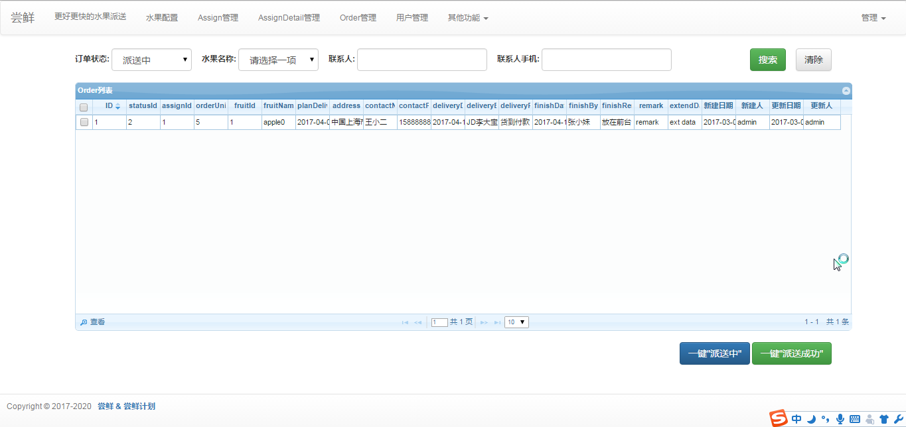
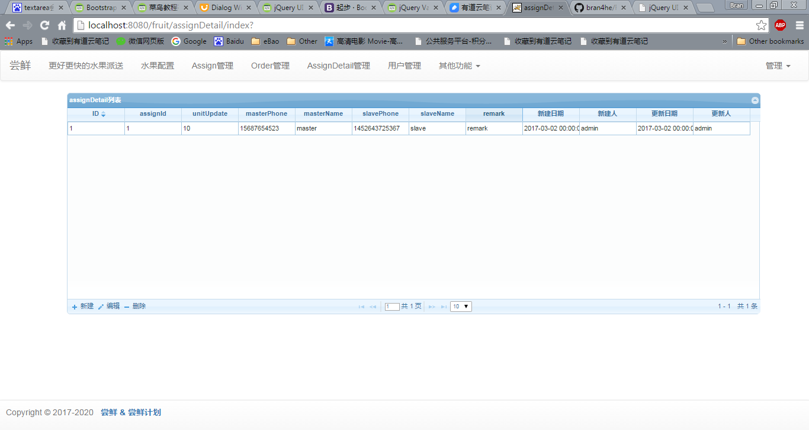

# FruitSMSDemo
a demo for fruit sales management system


# 部署
1. 填写jdbc.properties中c3p0.password=，注意不要commit这个密码
2. 注释或删除jdbc.properties中#local c3p0的相关配置
3. 替换war包的jdbc.properties，或者直接mvn clean package -Dmaven.test.skip=true

# Requirement

+ fruitMonth:水果上架的月份
+ maxOrderDay:可以触发下单（主单）操作的最晚日期，限制为当月的某号，如25号
+ maxProvNum:此批次水果最大可提供份数（水果都是按份数计算） -  **暂时不对此做限制**
+ maxOrderNum:一单（主单）最多可以下几份，如2份，
+ 注意：主单一个月对一个水果只可以下一份 - **需要确认需求**


# Coding Progress

## Plan:

- - -
### new feature

1. 管理员设计 - 20170322
2. 首页及菜单设计	- 20170324
3. Jqrid加载数据及显示 - 20170324
4. 菜单切换功能模块设计  - 20170324
5. 管理员日志设计 - 20170323
6. 登录接口设计 - 20170323
7. 验证码及系统权限控制  - 20170323
8. 订单状态设计 - 20170322
9. 实现前端全部的增删改的设计和coding, 使用orderstatus为范例 - 20170327
10. 统一全部前端jqgrid, jquery-ui 入口到index.js - 20170328
11. 完成公共参数, 用户管理, 登录日志, 订单状态的全部前台后台工作 - 20170328
12. add paging function from server part - 20170329
13. add ASSIGN function from back-end and front-end - 20170329
14. add ASSIGN_DETAIL function from back-end and front-end - 20170329
15. add jquery-ui datepicker and jQuery-Timepicker-Addon for pick up date and time - 20170329
16. add api of phone register - 20170405
17. add api of order - 20170405
18. add api of validate phone - 20170405
19. add api for user cancle order - 20170406
20. add auth validation for integration api - 20170406
21. add Spring AOP for log
22. slavePhone有条件性编辑来保持系统逻辑简单 - 20170406
23. add api of validate wechatOpenId - 20170406
24. add quick operation for changing order status - 20170406
25. 增加查看功能，多列信息是方便查看 - 20170407
26. 增加order页面的条件搜索功能 -  20170407(updated project screenshot)
27. 增加assgin页面的条件搜索功能 - 20170407
28. 增加assigndetail页面的条件搜索功能 - 20170407
29. 增加fruit config页面的条件搜索功能 - 20170407
30. 增加公共参数：默认收礼人建立时的默认有效期为3年 及相关逻辑  -20170408
31. 增加前端新建和修改时的必填字段校验及提示信息   -20170408
32. 备注改为非必填字段，后台判断是否为空，为空时置为默认备注  -20170408
33. 修改jqgrid显示如激活、虚拟号、订单状态为真实字面意义，隐藏原来关联的id -20170408
34. 增加AOP注解方式输出系统日志   -20170408
35. 更新页面的显示信息，更为正式和商业   -20170409
36. 增加逻辑：保存水果配置时，最大可定数量小于已存在的订单   -20170409
37. 自动保存微信端下单时的地址信息，关联到openId - 20170410
38. 收礼人下单时提供列表，并提供删除功能相关接口 - 20170410
39. 订单管理页面支持收礼人姓名和收礼人手机号查询功能 - 20170410
40. 使用c3p0数据库连接池代替DBCP，解决新浪SAE数据库默认设置max_wait=10s导致connection关闭却仍然存在pool里，引发的查询失效问题。 - 20170411
41. 增加部署说明 - 20170411
42. 暂时允许第三方跨域请求微信API controller: @CrossOrigin(origins = "*") or mvc:cors - 20170411
43. 增加微信查询水果列表接口 - 20170412
44. 增加微信查询当前月份水果列表接口 - 20170413
45. 后台水果配置页面增加显示当前月份水果功能  - 20170414
46. 微信接口增加一单多水果的功能 - 20170413
47. 后台准备设计方法，显示一单多水果功能的展示 - 20170415
48. 双击订单显示订单详细 - 20170415
49. 格式化和标准化订单查询信息 - 20170420
50. 增加短信调用接口，调用微信端的接口在用户获得分配水果时接收提醒短信 - 20170424
51. 增加查询最大可订单日的微信端接口 - 20170426
52. 简化页面格式选择，只显示yyyy-MM-dd(只保留登录日志精确到时分秒) - 20170427
53. 新增defaultAddr字段，用于标识用户的默认地址，用于自动填充 - 20170427
54. 新增控件用于数量的操作，防止不当操作。支持设置初始值，最小最大值 - 20170428
55. 更新下单接口，支持参数是否将此单地址设为默认地址，兼容之前设计的下单接口 - 20170430
56. 新增接口 统计当月用户已经下的订单数量（待派送的订单数量） - 20170430
57. 根据讨论，删除水果设置上的最大订单日限制 - 20170502
- - - 

### bug fix
1. assign page cannot use view function - 20170407
2. user order missing verify of public config of max_order_day_to -  20170407
3. fix user order and save common address, should getNextId for entity to save - 20170410
4. user login record save date time(db) but query/list without HH:mm:ss - 20170411
5. fix jquery ajax with CORS issue - 20170412
6. fix bug of cannot query order from wechat - 20170420
7. fix bug that user can cancel canceled orders - 20170427

- - -

### function design

+ ~~Jqgrid调用同一增删改接口 js和前端控制研究和设计~~ -  done #10
+ ~~管理退出登录控制及session设置~~ - done #11
+ ~~ASSIGN设计~~ - done #14
+ ~~ASSIGN DETAIL设计~~ - done #14
+ ~~ORDER设计~~ - done #13
+ ~~系统参数设计~~ - done #11
+ ~~暂时未设计翻页操作，全部使用loadonce=ture设计，后期改进~~ - done #12
+ ~~setup new ORDER, how to desgin UI and get data from ASSIGN~~ - done

- - -

## 微信第三方接口的安全性设计
+ 方案1：AOP
+ 方案2：Interceptor

说明：
1. 选择方案2，可以方便的自定义拦截路径，不需要在每一个api上加上注解，直接通过xml配置即可。
2. rest/user/register/用户注册激活请求不需要认证
2. 其他请求需要在HTTP请求header上加上Auth属性，属性值为当前wechatOpenId


## 微信API


### 提供号码是否存在及激活在Assign表里

**Request:**
```
URL: {web_root}/rest/user/validatePhone/{phone}
```
**Response:**
```
{
  "code": "success",
  "value": {status},
  "msg": null
}
```

**value of return**
```
	ACTIVE("active"), 
	NOTACTIVE("notactive"), 
	NA("NA");
```

**sample**
```
GET  fruit/rest/user/validatePhone/1588888888
```

- - -

### 校验wechatOpenId的状态
**Request:**
```
URL: {web_root}/rest/user/validateWechatId/{wechatId}
```
> 其他同上

### 激活手机号码并关联存储wechatOpenId
**Request:**
```
URL: {web_root}/rest/user/register/{phone}/{wechatOpenId}
```

**Response**
```
{
  "code": "{code}",
  "value": {status},
  "msg": null
}
```

**code**
```
	SUCCESS("success"), 
	EXCEPTION("exception"), 
	FAIL("fail");
```

**value**
```
PARAM_NOT_CORRECT: -1
PROCESS_SUCCESS:0
USER_NOT_EXISTS:1
```

**sample**
```
GET  fruit/rest/user/register/1588888888/QWERTYUIOP
{
  "code": "success",
  "value": "0",
  "msg": null
}
```

### 下订单接口
**Request:**
```
POST: {web_root}/rest/order/userOrder/{wechatOpenID}/{isDefaultAddr}
BODY:
{JSON DATA}
```
**参数**
`isDefaultAddr`是否将此单地址设为默认地址。
1. 不传递此参数或者传递0，将不将此地址设为默认
2. 传递1，将此单地址设为默认地址

**Response**
```
{
  "code": null,
  "value": null,
  "msg": null
}

```
**code**
```
	SUCCESS("success"), 
	EXCEPTION("exception"), 
	FAIL("fail");
```

**value**
```
	PARAM_NOT_CORRECT = new String("-1");
	PROCESS_SUCCESS = new String("0");
	//user verify
	public static final String USER_NOT_AUTH = new String("1");
	//public config
	public static final String EXCEED_ORDER_DAY_CFG = new String("2");
	//fruit config
	public static final String EXCEED_MAX_ORDER_LIMIT = new String("3");
	//fruit config
	public static final String EXCEED_MAX_ORDER_DATE = new String("4");
	//assign
	public static final String EXCEED_ASSIGN_BALANCE_UNIT = new String("5");
	//fruit config, ignore
	public static final String EXCEED_FRUIT_BALANCE = new String("6");
```

**msg**
```
null
order data(success)
```

**sample**
```
POST  fruit/order/userOrder/QWERTYUIOP
BODY 
{
    "fruitList": [
        {
            "fruitId": 1,
            "fruitName": "apple",
            "orderUnit": 2
        },
        {
            "fruitId": 2,
            "fruitName": "香蕉",
            "orderUnit": 3
        }
    ],
    "assignId": null,
    "address": "浦东新区新桥镇",
    "contactName": "jacky chen",
    "contactPhone": "15689065432",
    "remark": "记录下"
}
```

Response:
```
//success
{
  "code": "SUCCESS",
  "value": "0",
  "msg": "{\"id\":\"2\",\"statusId\":\"1\",\"slaveName\":\"收礼人小何\",\"slavePhone\":\"15692132432\",\"assignId\":\"1\",\"planDeliveryDate\":\"2017-04-20 16:41:03\",\"address\":\"浦东新区新桥镇\",\"contactName\":\"jacky chen\",\"contactPhone\":\"15689065432\",\"deliveryDate\":\"2017-04-20 16:41:03\",\"deliveryBy\":\"DeliveryBy\",\"deliveryRemark\":\"DeliveryRemark\",\"finishDate\":\"2017-04-20 16:41:03\",\"finishBy\":\"FinishBy\",\"finishRemark\":\"FinishRemark\",\"remark\":\"记录下\",\"extendData\":\"extdata\",\"insertDate\":\"2017-04-13 16:41:03\",\"updateDate\":\"2017-04-13 16:41:03\",\"insertBy\":\"unknown\",\"updateBy\":\"unknown\"}"
}

//fail
{
  "code": "EXCEPTION",
  "value": "6",
  "msg": null
}
```

- - -

### 我的订单查询接口，使用条件过滤
**Request:**
```
POST: {web_root}/rest/order/query/{wechatId}/{status}
```
**status**
```
	 ALL = "0";
	 WAIT_FOR = "1";
	 DELIVERYING = "2";
	 DELIVERY_SUCCESS = "3";
	 CUSTOMER_CANCLE = "4";
	 DELIVERY_FAIL = "5";
```

**Response**
```
{
  "code": {code},
  "value": {value},
  "msg": {list of order}
}
```

**sample**
Request:
GET fruit/rest/order/query/QWERTYUIOP/1

Response:
```
{
  "code": "SUCCESS",
  "value": "0",
  "msg": "[{\"id\":\"2\",\"statusId\":\"1\",\"statusValue\":\"待派送\",\"assignId\":null,\"wechatOpenid\":\"QWERTYUIOP\",\"orderDetail\":[{\"id\":\"2\",\"orderUnit\":2,\"fruitId\":\"1\",\"fruitName\":\"apple\"},{\"id\":\"3\",\"orderUnit\":3,\"fruitId\":\"2\",\"fruitName\":\"香蕉\"}],\"planDeliveryDate\":\"2017-04-20 16:41:03\",\"address\":\"浦东新区新桥镇\",\"contactName\":\"jacky chen\",\"contactPhone\":\"15689065432\",\"deliveryDate\":\"2017-04-20 16:41:03\",\"deliveryBy\":\"DeliveryBy\",\"deliveryRemark\":\"DeliveryRemark\",\"finishDate\":\"2017-04-20 16:41:03\",\"finishBy\":\"FinishBy\",\"finishRemark\":\"FinishRemark\",\"remark\":\"记录下\",\"extendData\":null,\"insertDate\":\"2017-04-13 16:41:03\",\"updateDate\":\"2017-04-13 16:41:03\",\"insertBy\":\"unknown\",\"updateBy\":\"unknown\"}]"
}
```

- - -

### 取消订单接口

**Request:**
```
GET: {web_root}/rest/order/cancleOrder/{orderId}
```

**Response**
```
{
  "code": {code},
  "value": {value},
  "msg": {JSON of order if success}
}
```

**sample**
Request:
GET fruit/rest/order/cancleOrder/2

Response:
```
{
  "code": "SUCCESS",
  "value": "0",
  "msg": "{\"id\":\"2\",\"statusId\":\"4\",\"assignId\":\"1\",\"orderUnit\":1,\"fruitId\":\"1\",\"fruitName\":\"apple0\",\"planDeliveryDate\":\"2017-04-12 14:50:28\",\"address\":\"中国上海市淞沪路270号创智天地广场3号楼\",\"contactName\":\"王小二\",\"contactPhone\":\"15888888888\",\"deliveryDate\":\"2017-04-12 14:50:28\",\"deliveryBy\":\"DeliveryBy\",\"deliveryRemark\":\"DeliveryRemark\",\"finishDate\":\"2017-04-12 14:50:28\",\"finishBy\":\"FinishBy\",\"finishRemark\":\"FinishRemark\",\"remark\":\"remakr\",\"extendData\":\"extdata\",\"insertDate\":\"2017-04-05 14:50:28\",\"updateDate\":\"2017-04-06 09:47:11\",\"insertBy\":\"unknown\",\"updateBy\":\"unknown\"}"
}
```

- - -

### 查询余额接口

**Request:**
```
GET: {web_root}/rest/assign/checkBalance/{wechatId}
```

**Response**
```
{
  "code": {code},
  "value": {value},
  "msg": null
}
```

**sample**
Request:
GET fruit/rest/assign/checkBalance/QWERTYUIOP

Response:
```
{
  "code": "SUCCESS",
  "value": "5",
  "msg": null
}
```

- - -

### 查询下单人常用地址列表接口（增加默认地址标志位）

>defaultAddr:1是默认地址，0是非默认地址，一个用户只能有一个默认地址。

**Request:**
```
GET: {web_root}/rest/order/queryAddress/{wechatId}
```

**Response**
```
{
  "code": {code},
  "value": {value},
  "msg": {address list}
}
```

**sample**
Request:
GET fruit/rest/order/queryAddress/QWERTYUIOP

Response:
```
{
  "code": "SUCCESS",
  "value": "0",
  "msg": "[{\"id\":\"1\",\"address\":\"中国上海市淞沪路270号创智天地广场3号楼\",\"contactName\":\"张晓霞\",\"contactPhone\":\"15888888888\",\"wechatOpenid\":\"QWERTYUIOP\",\"defaultAddr\":1},{\"id\":\"2\",\"address\":\"中国上海市大渡河路138弄长风公园\",\"contactName\":\"李大庄\",\"contactPhone\":\"13056721342\",\"wechatOpenid\":\"QWERTYUIOP\",\"defaultAddr\":0},{\"id\":\"3\",\"address\":\"美国华盛顿州金色大街\",\"contactName\":\"jack\",\"contactPhone\":\"01088888\",\"wechatOpenid\":\"QWERTYUIOP\",\"defaultAddr\":0}]"
}
```

- - -

### 下单人删除常用地址列表接口

**Request:**
```
GET: {web_root}/rest/order/delAddress/{addressId}
```

**Response**
```
{
  "code": {code},
  "value": {value},
  "msg": null
}
```

**sample**
Request:
GET fruit/rest/order/delAddress/1

Response:
```
{
  "code": "SUCCESS",
  "value": "0",
  "msg": null
}
```

- - -


### 查询水果列表接口

**Request:**
```
GET: {web_root}/rest/fruit/listFruit
```
**Response**
```
{
  "code": {code},
  "value": {value},
  "msg": {list of fruit}
}
```

**sample**
Request:
GET fruit/rest/fruit/listFruit

Response:
```
{
  "code": "SUCCESS",
  "value": "0",
  "msg": "[{\"id\":\"1\",\"fruitName\":\"apple\",\"fruitMonth\":\"2017-03-02 00:00:00\",\"maxOrderDay\":\"2017-04-25 00:00:00\",\"fruitArea\":\"shanghai\",\"maxOrderNum\":5,\"maxProvNum\":99,\"remark\":\"this is remark\",\"extendData\":\"{name:\"tom\"}\",\"insertDate\":\"2017-03-02 00:00:00\",\"updateDate\":\"2017-03-02 00:00:00\",\"insertBy\":\"admin\",\"updateBy\":\"admin\"},{\"id\":\"2\",\"fruitName\":\"香蕉\",\"fruitMonth\":\"2017-02-02 00:00:00\",\"maxOrderDay\":\"2017-02-25 00:00:00\",\"fruitArea\":\"shanghai\",\"maxOrderNum\":5,\"maxProvNum\":99,\"remark\":\"this is remark\",\"extendData\":\"{name:\"jack\"}\",\"insertDate\":\"2017-02-02 00:00:00\",\"updateDate\":\"2017-02-02 00:00:00\",\"insertBy\":\"admin\",\"updateBy\":\"admin\"},{\"id\":\"3\",\"fruitName\":\"芒果\",\"fruitMonth\":\"2017-04-10 00:00:00\",\"maxOrderDay\":\"2017-04-29 00:00:00\",\"fruitArea\":\"菲律宾\",\"maxOrderNum\":2,\"maxProvNum\":100,\"remark\":\"default_remark\",\"extendData\":\"{name:value}\",\"insertDate\":\"2017-04-10 15:04:55\",\"updateDate\":\"2017-04-10 15:04:55\",\"insertBy\":\"unknown\",\"updateBy\":\"unknown\"}]"
}
```

- - -

### 查询最大可订单日(当月)

**Request:**
```
GET: {web_root}/rest/pub/maxOrderDay
```
**Response**
```
{
  "code": {code},
  "value": {value},
  "msg": {max order day}
}
```

**sample**
Request:
GET fruit/rest/pub/maxOrderDay

Response:
```
{
  "code": "SUCCESS",
  "value": "0",
  "msg": "25"
 }
```

- - -

### 设置默认地址

**Request:**
```
GET: {web_root}/rest/order/defaultAddr/{wechatId}/{addrId}
```
**Response**
```
{
  "code": {code},
  "value": {value},
  "msg": null
}
```

**sample**
Request:
GET fruit/rest/order/defaultAddr/QWERTYUIOP/1

Response:
```
{
  "code": "SUCCESS",
  "value": "0",
  "msg": null
}
```
- - -

### 统计当月用户已经下的订单数量（待派送的订单数量）

**Request:**
```
GET: {web_root}/rest/order/waitForNums/{wechatId}
```
**Response**
```
{
  "code": {code},
  "value": {value},
  "msg": {count}
}
```

**sample**
Request:
GET fruit/rest/order/waitForNums/QWERTYUIOP

Response:
```
{
  "code": "SUCCESS",
  "value": "0",
  "msg": "{\"count\":5}"
}
```


## Assign

>后台

+ 不允许add/update/delete

>前台

+ 提供接口提供手机号码状态查询 - done
+ 激活号码时更新status - done
+ 下订单时减少unit - done
+ 取消订单时增加unit - done

## AssignDetail - 后台管理人员控制源数据

>后台

+ 允许add - done
+ 不允许delete，写错数量时允许unit填负值进行对冲 -done
+ 允许有条件的编辑：
	+ 不允许编辑unit，只允许新建正值增加或者新建负值对冲  -done
	+ slavePhone允许编辑，新建是为真实，编辑时仍为真实，不允许修改为虚拟 - done
	+ 新建时虚拟，编辑时强制虚拟号码改为真实号码  - done
	+ isVirtual不允许编辑，新建时时真号码，一直是真实；新建时是虚拟，第一次编辑置强制置为真实并且不允许改动
+ 所有的改动只允许按规定流程顺序执行，不能错乱或者回退信息流

>前台


## Order - 前台消费数据控制

>后台

+ 不允许add/edit/delete
+ 不允许更新订单 - 后台管理不负责更新订单的信息，全部由前台来操作
+ 提供两个按钮，支持批量选择，支持status更改'待派送' -> '派送中' -> '派送成功' - done
+ 订单状态参数的新建和修改不开放 - done

>前台

+ 提供必要的接口参数，给前台下订单使用(add接口) - done
+ 支持前台订单的取消（地址等信息错误重新下单） - done


- - -

# Demo Show

> page with quick operation & criteria search



> common page




# Design API

> Wait...

# Design DB

> 初始化脚本见项目目录


# Design Overall

> Business requirements


