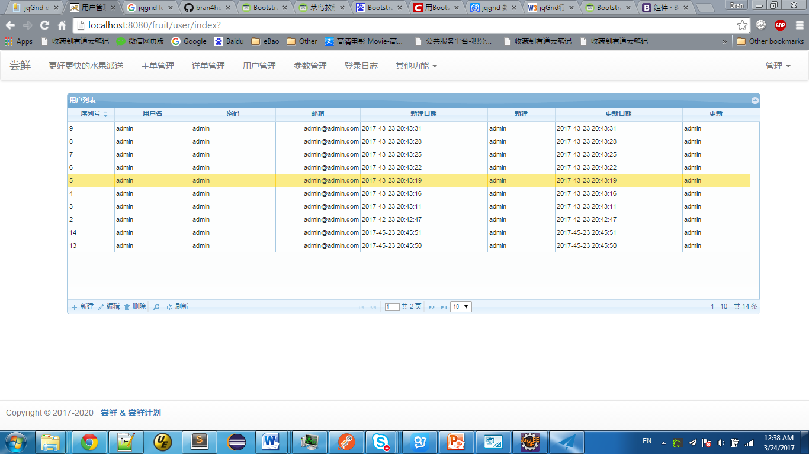

# FruitSMSDemo
a demo for fruit sales management system

# Coding Progress

## Plan:

- - -

1. 管理员设计 - 20170322
2. 首页及菜单设计	- 20170324
3. Jqrid加载数据及显示 - 20170324
4. 菜单切换功能模块设计  - 20170324
5. 管理员日志设计 - 20170323
6. 登录接口设计 - 20170323
7. 验证码及系统权限控制  - 20170323
8. 订单状态设计 - 20170322

- - - 

+ Jqgrid调用同一增删改接口 js和前端控制研究和设计
+ 管理退出登录控制及session设置
+ 客户设计
+ 主单设计
+ 次单设计
+ 系统参数设计

> 未完待续...

- - -

## Demo Show




# Design API
**OrderStatus**
### 1
request:
```
GET /os/all
```
response:
```
[
  {
    "id": "1",
    "name": "待派送"
  },
  {
    "id": "2",
    "name": "派送中"
  },
  {
    "id": "3",
    "name": "派送成功"
  },
  {
    "id": "4",
    "name": "用户取消"
  },
  {
    "id": "5",
    "name": "派送失败"
  }
]
```
### 2
request:
```
POST /os/add
BODY
{
    "id":null,
    "name":"test"
}
```
response:
```
{
  "result": true,
  "msg": {
    "data": {
      "id": "72",
      "name": "test"
    }
  }
}
```

### 3
request:
```
GET /os/delete/{id} //id=72
```
response:
```
{
  "result": true,
  "msg": {
    "data": {
      "id": "72",
      "name": test
    }
  }
}
```

# Design DB
**OrderStatus**
```
drop table if exists T_ORDER_STATUS;
CREATE TABLE `T_ORDER_STATUS` (
`id` int(5) NOT NULL AUTO_INCREMENT, 
`name` VARCHAR(20) NOT NULL,
PRIMARY KEY(`id`)
); 
alter table T_ORDER_STATUS AUTO_INCREMENT=0;
```

> 初始化脚本见项目目录


# Design Overall

> 原则：

+ 尽量从简设计
+ 实体类和数据库表的对应规则，方便进行快速ORM/CURD操作。如OrderStatus类代表订单状态，对应DB表设计为T_ORDER_STATUS


**管理人表**
*T_USER*
id|name|desc

**客户表**
*T_CUSTOMER*

**产品表**
*T_PRD*
id|name|price|place|desc

**订单表**
*T_ORDER*

+ 产品信息和客户信息会复制一份到所产生的订单，防止产品更新和客户更新导致订单信息错乱

